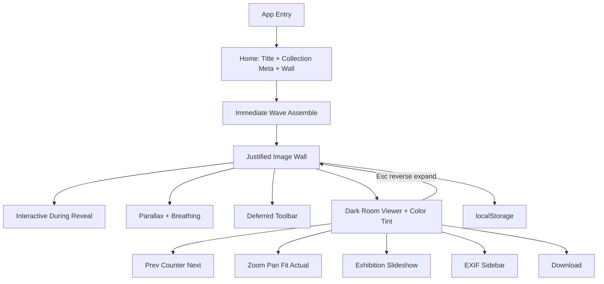
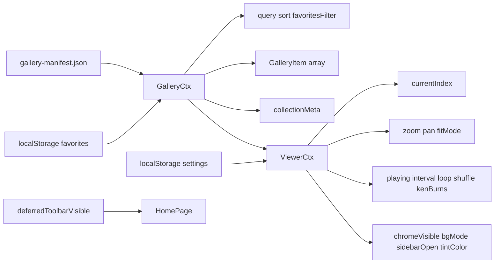

# Gallery Experience — Architecture Plan

Greenfield build. Stack: **Vite + React + TypeScript + TailwindCSS + Framer Motion + GSAP + Lenis + React Icons**. State via React Context + hooks + `localStorage`. Image discovery via a Vite plugin that scans `public/gallery/` and emits a manifest.

**Core principle:** The interface should disappear. The photographs should remain in memory.

This is a **premium photography application** (Apple Photos, Lightroom, Arc, Linear, Raycast, editorial books) — not a portfolio site, agency landing, dashboard, file explorer, CMS, or marketing page.

Experience sources of truth:

- [`docs/EXPERIENCE_DESIGN.md`](docs/EXPERIENCE_DESIGN.md) — emotional journey & interaction philosophy
- [`docs/VISUAL_LANGUAGE.md`](docs/VISUAL_LANGUAGE.md) — typography, color, spacing, motion tokens

---

## Design Philosophy

| Principle | Meaning |
|---|---|
| **Calm** | Quiet surfaces; no visual noise; generous whitespace |
| **Cinematic** | Dark-room viewing; spatial continuity; restrained motion |
| **Minimal** | Less UI; chrome only when needed |
| **Premium** | Craft in typography, spacing, easing — never decoration |
| **Photography-first** | Photographs are the product; interface disappears |
| **Invisible Interface** | Toolbar deferred; viewer chrome auto-hides |
| **Spatial Continuity** | Open/close preserves where the image lived on the wall |
| **Motion with Purpose** | Animation explains origin, destination, or emotion |
| **Immediately Interactive** | Wave reveal never blocks clicks on visible images |
| **Owned Environment** | Viewer background tinted ~3–5% from image dominant color |

**References:** Apple Photos, Adobe Lightroom, Arc Browser, Linear, Raycast, Notion Calendar, premium editorial photography books, Scandinavian editorial design.

**Anti-patterns:** agency portfolios, gaming sites, heavy WebGL showcases, dashboard/CMS/file-manager UI, bounce/elastic showmanship, particles, cubes, page flips.

---

## 1. Information Architecture



**Surfaces**

- **Home (gallery)** — Title + editorial collection meta above an immediately assembling justified wall. No Explore gate.
- **Deferred toolbar** — Search / sort / favorites; fades in after scroll, interaction, shortcut, or top hover.
- **Dark Room Viewer** — Shared-element expand; dominant-color tint; auto-hiding chrome.
- **Info Sidebar** — Optional EXIF / file metadata; hidden when empty.
- **Slideshow** — Exhibition mode: cursor + chrome fade; photographs only.

**User flows**

1. Land → **Gallery Experience** + collection personality + wall placeholders → wave reveal starts immediately  
2. User may click any already-revealed image **during** the wave — interaction never waits  
3. Browse with ambient parallax + nearly invisible breathing; toolbar appears when needed  
4. Hover elevates photo in the depth stack (scale ~1.02)  
5. Open → wall darkens/desaturates; selected stays full color; expands into tinted dark room  
6. Navigate with animated counter; N±1 preload; subtle slide-fades  
7. Slideshow → cursor/chrome gone; Ken Burns 100→104%; controls on movement  
8. Escape → reverse expand to cell; restore scroll  

**Data model (offline)** — unchanged

- Source of truth: files in [`public/gallery/`](public/gallery/)
- Build/dev-time manifest: `public/gallery-manifest.json` (generated)
- Optional collection meta: title, location, date range, photographer (config/manifest field)
- Client enrichments: dimensions, orientation, EXIF via `exifr`, dominant color for viewer tint
- Persistence: favorites, sort, slideshow, last viewed, viewer background, scroll position

---

## 2. Component Tree

```
App
├── CursorProvider (desktop; quiet — not gaming)
├── GalleryProvider (manifest, filter, sort, favorites, collectionMeta)
├── LenisRoot (smooth scroll)
├── HomePage
│   ├── CollectionHeader
│   │   ├── BrandTitle ("Gallery Experience")
│   │   └── CollectionMeta (title · count · dates · photographer)
│   ├── GalleryToolbar (deferred fade-in)
│   └── JustifiedGallery
│       ├── ReservedPlaceholders (geometry locked)
│       ├── WaveRevealController (priority organic stagger)
│       ├── AmbientParallaxLayer (pointer 3–8px)
│       ├── BreathingLayer (~1px / 8–12s)
│       ├── VirtualizedRows
│       └── ImageCard (interactive as soon as visible)
└── ViewerPortal
    └── FullscreenViewer (dark room + dominant tint)
        ├── ExpandingImage (shared-element / FLIP)
        ├── WallDesaturateOverlay (opening sequence)
        ├── VignetteGrain (optional, very low opacity)
        ├── ViewerChrome (auto-hide ~2s)
        │   ├── TopRight: Download | Info | Close
        │   └── BottomCenter: Prev | AnimatedCounter | Next
        ├── ZoomStage
        ├── MetaSidebar
        └── SlideshowController (hide cursor/chrome)
```

Folder structure unchanged; experience pieces live under existing `brand/`, `gallery/`, `viewer/`, and `hooks/`.

---

## 3. Folder Structure

Unchanged engineering layout:

```
gallery-experience/
├── public/
│   ├── gallery/
│   │   └── .gitkeep
│   └── gallery-manifest.json
├── docs/
│   ├── EXPERIENCE_DESIGN.md      # Emotional / interaction source of truth
│   └── VISUAL_LANGUAGE.md        # Visual design system
├── scripts/
│   └── generate-gallery-manifest.ts
├── src/
│   ├── main.tsx
│   ├── App.tsx
│   ├── components/
│   │   ├── brand/BrandHero.tsx   # CollectionHeader
│   │   ├── cursor/MagneticButton.tsx, CustomCursor.tsx
│   │   ├── gallery/JustifiedGallery.tsx, ImageCard.tsx, GalleryToolbar.tsx
│   │   ├── ui/IconButton.tsx, Skeleton.tsx, FocusRing.tsx, AnimatedCounter.tsx
│   │   └── viewer/
│   │       FullscreenViewer.tsx, ExpandingImage.tsx, ZoomStage.tsx,
│   │       ViewerChrome.tsx, MetaSidebar.tsx, SlideshowControls.tsx,
│   │       BackgroundLayer.tsx
│   ├── hooks/
│   │   useGallery.ts, useJustifiedLayout.ts, useViewerNav.ts,
│   │   useImagePreload.ts, useSlideshow.ts, useZoomPan.ts,
│   │   useAutoHideUI.ts, useFavorites.ts, useLocalStorage.ts,
│   │   useExif.ts, useMediaQuery.ts, useKeyboard.ts,
│   │   useWaveReveal.ts, useAmbientParallax.ts, useBreathing.ts,
│   │   useDominantColor.ts, useDeferredToolbar.ts
│   ├── context/GalleryContext.tsx, ViewerContext.tsx, CursorContext.tsx
│   ├── lib/
│   │   justified.ts, sort.ts, orientation.ts, preload.ts,
│   │   download.ts, format.ts, storage.ts, waveOrder.ts, colorSample.ts
│   ├── types/gallery.ts, viewer.ts, exif.ts
│   ├── styles/globals.css, tokens.css
│   └── vite-plugins/galleryManifest.ts
├── index.html
├── package.json
├── vite.config.ts
├── tailwind.config.ts
└── tsconfig.json
```

---

## 4. Experience & Motion Strategy

### Home (gallery-first — no landing gate)

```text
Gallery Experience
Landscapes of India
248 Photographs · Captured 2021–2026
[ justified wall assembles immediately ]
```

No Explore button. No Space-to-start. Users immediately understand they are here to explore photographs.

### Immediately interactive

1. Calculate geometry  
2. Render reserved placeholders  
3. **User can already interact**  
4. Wave reveal continues independently  

Images that have appeared are clickable at once. **Interaction must never wait for animation.**

### Gallery reveal (reserved layout)

Placeholders locked first — zero CLS. Cells: fade + translate 20–40px + scale from 0.97 + ≤5° rotation → spring to rest. Full assemble ~1.5s. Feeling: assembled, not animated.

### Progressive wave (signature)

Organic priority — not L→R, T→B, or pure random:

- Larger photographs slightly earlier  
- Hero / dominant images first  
- Smaller images fill remaining gaps  

Stagger 15–25ms. GSAP timeline over reserved grid.

### Ambient life (post-settle)

- **Parallax:** pointer → 3–8px floating-paper shift; stops on pointer leave  
- **Breathing:** every 8–12s, ~1px + tiny brightness shift — almost invisible visual life, not floating decoration  

### Deferred toolbar

Initial chrome: title + collection meta only. Search / sort / favorites fade in after scroll, interaction, search shortcut, or top-area hover.

### Hover & depth

```text
Background → Gallery Plane → Hovered Photograph → Fullscreen Viewer
```

Hover: scale ~1.02, slight brightness, soft shadow, optional filename. No overlays or floating buttons.

### Opening sequence (hero)

1. Background gently darkens  
2. Gallery slightly desaturates  
3. Selected image keeps full color  
4. Shared-element expand into viewer  
5. Dominant-color tint (~3–5%) applied to charcoal base  

Not a popup — another viewing mode.

### Viewer (dark room)

Charcoal + sampled tint (snow→cool, forest→muted green, ocean→navy, sunset→warm graphite). Optional vignette/grain at very low opacity.

**Chrome:** bottom center Prev · **AnimatedCounter** · Next; top right Download · Info · Close. Auto-hide ~2s.

**Counter:** digits animate individually (`020`→`021`).

### Manual nav transitions

Current slides ~8% while fading; incoming from opposite direction — Netflix-subtle.

### Slideshow (digital exhibition)

On play: cursor fades, chrome fades, only photographs remain, Ken Burns 100→104%. Controls return immediately on movement. Crossfade only — no cubes/flips.

### Closing

Reverse expand to original cell; restore scroll; never hard-cut.

---

## Motion Rules

| Rule | Limit |
|---|---|
| Maximum rotation | **5°** |
| Maximum hover scale | **1.02** |
| Maximum reveal movement | **40px** |
| Maximum single reveal duration | **900ms** |
| Maximum stagger | **25ms** |
| Full gallery assemble | **~1.5s** |
| Ambient parallax | **3–8px** |
| Breathing | **~1px / 8–12s** |
| Ken Burns scale | **100% → 104%** |
| Nav slide offset | **~8%** |
| Chrome auto-hide | **~2s** |
| Dominant tint | **3–5%** |

**Forbidden:** bounce, elastic showmanship, flashy easing, particles, explosions, large camera swings, infinite decorative animations, layout-shifting reveals, blocking interaction for motion.

Numeric tokens: [`docs/VISUAL_LANGUAGE.md`](docs/VISUAL_LANGUAGE.md).

Honor `prefers-reduced-motion`: skip wave rotation, parallax, breathing, Ken Burns; short opacity only.

---

## Technology Responsibilities

| Tool | Responsibility |
|---|---|
| **Framer Motion** | Shared-element open/close, UI chrome, counter digits, toolbar fade |
| **GSAP** | Wave reveal timeline, ambient parallax, breathing, cinematic loading beats |
| **Lenis** | Smooth scrolling; restore continuity on close |
| **React Virtual** | Large gallery row windowing |
| **Three.js** | **Not in V1** — DOM-based app |

---

## 5. State Management Plan

**Unchanged pattern.** No Redux / Zustand. Three focused contexts + local state.



**`GalleryItem`** — unchanged shape; dominant color may be cached per id at runtime.

**Collection meta (optional):** `{ title?, location?, dateRange?, photographer? }` from manifest or small config beside it.

**Persistence keys:** `ge:favorites`, `ge:sort`, `ge:slideshow`, `ge:lastViewed`, `ge:viewerBg`, `ge:scrollY`.

No explore-gate flag — gallery is always the home experience.

---

## 6. Performance Strategy

**Unchanged architecture.** Critical for 100–1000+ images.

- **Discovery** — Vite plugin scans `public/gallery`; manifest with path, w/h, mtime, bytes  
- **Layout** — Justified rows precomputed before reveal; zero CLS  
- **Virtualization** — Row windowing via `@tanstack/react-virtual`  
- **Image loading** — lazy + async decode; skeleton → blur-up; interactive when painted  
- **Viewer memory** — Preload only N±1  
- **Color sample** — Sample on open (or once cache miss); cheap downscale canvas; do not block open  
- **EXIF** — Lazy when sidebar opens  
- **Motion** — Compositor props; reduced-motion path  

**Deps:** `framer-motion`, `gsap`, `lenis`, `react-icons`, `@tanstack/react-virtual`, `exifr`, `image-size` (dev/plugin). No Three.js in V1.

---

## 7. Accessibility Plan

- `<main>` home; gallery as list of buttons opening dialog  
- Viewer `role="dialog"` + `aria-modal` + focus trap  
- Keyboard: `←/→`, `Esc` (reverse close), `Space` slideshow play-pause, zoom keys, `F` favorite, `I` info, `/` or Cmd/Ctrl+K style search focus when toolbar deferred  
- Visible focus rings; `aria-label` on icon controls  
- Live region for counter (“Image 21 of 248”) — independent of digit animation  
- Touch targets ≥ 44px  
- `prefers-reduced-motion` respected  
- Contrast AA on charcoal / tinted / white viewer modes  

---

## 8. Responsive Strategy

- **Mobile** — Title + meta compact; dual/single justified; deferred toolbar as icon sheet; swipe viewer; parallax/breathing reduced or off  
- **Tablet** — Moderate density; sidebar drawer  
- **Desktop** — Full motion language; quiet cursor  
- **Ultra-wide** — Cap or denser full-bleed; letterboxed dark room  

---

## Visual Direction (locked)

- Dark charcoal room (`#0e0e0e`–`#141414`) + per-image tint  
- Display: Instrument Serif · UI: Outfit  
- Accent: warm platinum for focus only  
- Home: title + editorial meta **above** immediately assembling wall  
- Invisible UI: deferred toolbar; auto-hiding viewer chrome  

Details: [`docs/VISUAL_LANGUAGE.md`](docs/VISUAL_LANGUAGE.md).

---

## Core vs optional polish

**Core (ship with experience)**

- Immediate interactive wave reveal (priority algorithm)  
- Deferred toolbar  
- Collection personality fields  
- Opening desaturate + shared-element expand  
- Dominant-color viewer tint (3–5%)  
- Animated image counter  
- Breathing + ambient parallax  
- Exhibition slideshow (hide cursor/chrome)  

**Optional later**

- “Preparing Collection” narrative loading  
- Heavier multi-resolution pyramids  
- Scroll/last-viewed niceties beyond baseline persistence  

---

## Implementation Sequence (after approval)

Phases unchanged; experience refinements fold into the same milestones:

1. Scaffold Vite/React/TS/Tailwind + Framer Motion + GSAP + Lenis + design tokens + fonts  
2. Gallery manifest Vite plugin + sample images + types (+ optional collection meta)  
3. Justified layout + reserved placeholders + virtualized wall + priority wave reveal + ImageCard  
4. Deferred gallery toolbar (search, sort, favorites)  
5. Dark-room viewer + shared-element open/close + wall desaturate + dominant tint  
6. Nav + N±1 preload + slide-fades + animated counter  
7. Zoom/pan/fit/actual + background modes + auto-hide chrome (~2s)  
8. Exhibition slideshow + Ken Burns 100→104%  
9. Download + Meta sidebar (EXIF) + persistence  
10. Breathing + ambient parallax + a11y + responsive hardening  

Each commit stays reviewable and runnable.

**Out of scope for V1:** sound toggle, CMS, upload UI, server-side resizing, accounts, Three.js / WebGL heroes, Explore/landing gates.
