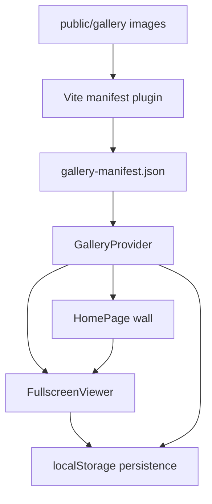
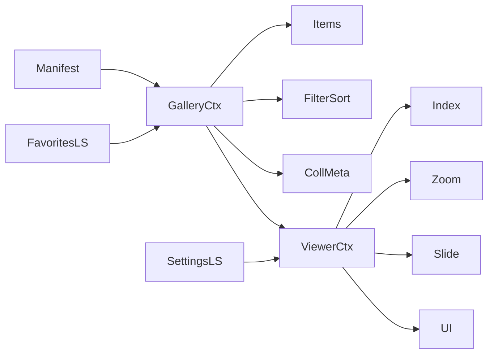

# Architecture

> **How** Gallery Experience is built.  
> Experience & why → [EXPERIENCE_DESIGN.md](./EXPERIENCE_DESIGN.md) · [DESIGN_DECISIONS.md](./DESIGN_DECISIONS.md)  
> Visual → [VISUAL_LANGUAGE.md](./VISUAL_LANGUAGE.md)  
> Motion → [MOTION_SYSTEM.md](./MOTION_SYSTEM.md) · [ANIMATION_SPEC.md](./ANIMATION_SPEC.md)  
> Components → [COMPONENT_GUIDELINES.md](./COMPONENT_GUIDELINES.md)  
> Interactions → [INTERACTION_INVENTORY.md](./INTERACTION_INVENTORY.md)

**Stack:** Vite · React · TypeScript · TailwindCSS · Framer Motion · GSAP · Lenis · React Icons  
**Data:** Offline files in `public/gallery/` + generated manifest · no backend · Context + `localStorage`

---

## Documentation map

| Document | Responsibility |
|---|---|
| **ARCHITECTURE** (this file) | System structure, data flow, performance, a11y engineering, phases |
| [PROJECT_PRINCIPLES](./PROJECT_PRINCIPLES.md) | Long-term product philosophy |
| [PRODUCT_GLOSSARY](./PRODUCT_GLOSSARY.md) | Canonical terminology |
| [EXPERIENCE_DESIGN](./EXPERIENCE_DESIGN.md) | Emotional journey & interaction feel |
| [VISUAL_LANGUAGE](./VISUAL_LANGUAGE.md) | Design system tokens |
| [MOTION_SYSTEM](./MOTION_SYSTEM.md) | Motion tokens, easing, rules |
| [ANIMATION_SPEC](./ANIMATION_SPEC.md) | Per-interaction animation sequences |
| [INTERACTION_INVENTORY](./INTERACTION_INVENTORY.md) | Master interaction catalogue |
| [UI_PATTERNS](./UI_PATTERNS.md) | Reusable UI patterns |
| [COMPONENT_GUIDELINES](./COMPONENT_GUIDELINES.md) | Component behaviour boundaries |
| [DESIGN_DECISIONS](./DESIGN_DECISIONS.md) | Product decision log |
| [ENGINEERING_STANDARDS](./ENGINEERING_STANDARDS.md) | Engineering conventions |
| [IMPLEMENTATION_PLAYBOOK](./IMPLEMENTATION_PLAYBOOK.md) | Phase implementation guidance |
| [FEATURE_LIFECYCLE](./FEATURE_LIFECYCLE.md) | Idea → maintenance |
| [QUALITY_CHECKLIST](./QUALITY_CHECKLIST.md) | Merge gate |
| [TESTING_STRATEGY](./TESTING_STRATEGY.md) | Testing philosophy |
| [ROADMAP](./ROADMAP.md) | Versioned product direction |
| [CONTRIBUTING](../CONTRIBUTING.md) | Contributor guide |

Avoid duplicating experience/motion prose here — link instead.

---

## System overview



Offline-first: drop images into `public/gallery/` → plugin regenerates manifest on dev/build → UI consumes JSON only.

---

## Folder structure

```text
gallery-experience/
├── public/gallery/                 # Drop images here
├── public/gallery-manifest.json    # Generated
├── docs/                           # Product documentation system
├── scripts/generate-gallery-manifest.ts
└── src/
    ├── components/{brand,cursor,gallery,ui,viewer}/
    ├── hooks/
    ├── context/
    ├── lib/
    ├── types/
    ├── styles/
    └── vite-plugins/galleryManifest.ts
```

Component behaviour: [COMPONENT_GUIDELINES.md](./COMPONENT_GUIDELINES.md).

---

## Component tree (structural)

```text
App
├── CursorProvider
├── GalleryProvider
├── LenisRoot
├── HomePage
│   ├── CollectionHeader
│   ├── GalleryToolbar          # deferred visibility
│   └── JustifiedGallery        # virtualized rows + wave
└── ViewerPortal
    └── FullscreenViewer
        ├── ExpandingImage
        ├── ZoomStage
        ├── ViewerChrome
        ├── MetaSidebar
        └── SlideshowController
```

Experience behaviours (reveal, tint, deferred toolbar, etc.) are specified in Experience / Animation docs — not restated here.

---

## State management

No Redux/Zustand. Three contexts + hooks.



**`GalleryItem`:** `id`, `src`, `filename`, `width`, `height`, `orientation`, `mtime?`, `bytes?`  
**Collection meta (optional):** title, location, dateRange, photographer  
**Persistence keys:** `ge:favorites`, `ge:sort`, `ge:slideshow`, `ge:lastViewed`, `ge:viewerBg`, `ge:scrollY`

Derived filtered/sorted lists via `useMemo`. Viewer index maps into the derived list.

---

## Data flow

1. Plugin scans `public/gallery` → writes manifest (path, dimensions via `image-size`, mtime, bytes)  
2. App loads manifest → `GalleryProvider`  
3. Justified layout precomputes rows for viewport width  
4. Virtualizer mounts visible rows; images lazy-load  
5. Open viewer → shared-element; preload N±1; optional EXIF on sidebar; dominant color sample for tint  
6. Mutations (favorites, settings) write through storage helpers  

---

## Technology responsibilities

| Tool | Responsibility |
|---|---|
| Framer Motion | Shared-element open/close, UI chrome, counter digits, toolbar fade |
| GSAP | Wave reveal, ambient parallax, breathing, cinematic loading beats |
| Lenis | Smooth scrolling; restore continuity |
| React Virtual | Row windowing |
| exifr | Lazy EXIF when sidebar opens |
| Three.js | **Not in V1** |

Motion token ownership: [MOTION_SYSTEM.md](./MOTION_SYSTEM.md).

---

## Image loading strategy

```text
Thumbnail / display-sized decode  →  Medium (wall)  →  Fullscreen stage  →  Original (download only)
```

| Concern | Approach |
|---|---|
| **Decoding** | `decoding="async"`; decode near viewport; viewer decodes current (+N±1) |
| **Caching** | Browser HTTP cache for static `/gallery/*`; optional in-memory dominant-color cache per id |
| **Preloading** | Viewer: **only N−1 and N+1**. Never entire album |
| **Memory** | Unmount offscreen wall imgs via virtualization; tear down stage on close; cap zoom bitmap pressure |
| **Transitions** | Do not swap sources mid-FLIP; promote to fullscreen src after expand when needed |
| **Progressive** | Skeleton → blur-up → full (Experience Level 4) |
| **Future responsive** | Optional build step for `srcset` widths; V1 may serve originals constrained by CSS/`sizes` |

Download always uses **original** bytes — no re-encode.

---

## Performance strategy

- Manifest dimensions reserve aspect boxes → minimize CLS  
- Justified geometry before paint/reveal  
- Row virtualization + overscan ~2  
- Compositor-friendly animation (`transform`/`opacity`)  
- Dominant color: downscale sample; must not block open  

### Performance budgets (targets)

| Metric | Budget |
|---|---|
| Initial JS (gzip, app critical) | ≤ **180KB** aim (watch animation libs) |
| LCP (sample collection, warm cache) | ≤ **2.5s** on mid desktop |
| CLS | **&lt; 0.1** (prefer ~0 via reserved boxes) |
| Gallery scroll | **≥ 50 FPS** steady on laptop while virtualizing |
| Animation | **≥ 50 FPS** during reveal/open on target hardware |
| Interaction latency (click→feedback) | **&lt; 100ms** |
| Max simultaneous decoded full-res in viewer | **≤ 3** (prev, current, next) |
| Wall decoded (approx) | Visible row imgs + small overscan only |
| Memory | Avoid unbounded image bitmap growth; no full-album decode |

Budgets are engineering targets — measure in CI/Lighthouse where practical.

---

## Progressive enhancement

| Level | Features | If unavailable |
|---|---|---|
| **0** | Manifest, wall, open/close, nav, download | — core |
| **1** | Motion (reveal, shared element, chrome) | Instant state changes |
| **2** | Ambient parallax | Static wall |
| **3** | Dominant-color tint | Flat charcoal |
| **4** | Blur-up / progressive polish | Skeleton → sharp |
| **5** | Future enhancements | Ignored |

`prefers-reduced-motion` forces motion toward Level 0–1 behaviour per [MOTION_SYSTEM.md](./MOTION_SYSTEM.md#reduced-motion).

---

## Accessibility

- Semantic home + gallery activators; viewer `role="dialog"` `aria-modal` + focus trap  
- Keyboard: arrows, Esc (reverse close), Space slideshow, zoom keys, `F` favorite, `I` info, search shortcut  
- Visible focus rings; labelled icon controls; live regions for index/results  
- Touch targets ≥ 44px  
- Contrast AA for chrome on charcoal/tint/white modes  
- Details of feel: Experience; reduced motion: Motion System  

---

## Responsive behaviour

| Surface | Behaviour |
|---|---|
| Mobile | Compact header; 1–2 col density; swipe viewer; reduced ambient; deferred toolbar as icon sheet |
| Tablet | Moderate density; sidebar drawer |
| Desktop | Full motion/cursor language |
| Ultra-wide | Cap or denser full-bleed; letterboxed viewer |

---

## Future product roadmap

Conceptual modules — **do not design here**; keep architecture extensible (context boundaries, manifest schema versioning):

Collections · Albums · Timeline · Map View · AI / colour / face search · Cloud sync · Printing · Presentation mode · Editing

---

## Implementation phases

Unchanged sequence — experience details live in other docs:

1. Scaffold + tokens/fonts + Lenis/Framer/GSAP  
2. Manifest plugin + types + sample images + collection meta fields  
3. Justified layout + placeholders + virtualization + wave reveal + ImageCard  
4. Deferred toolbar (search, sort, favorites)  
5. Dark-room viewer + shared-element + wall desaturate + dominant tint  
6. Nav + N±1 preload + slide-fades + animated counter  
7. Zoom/pan/fit/actual + background modes + auto-hide chrome  
8. Exhibition slideshow + Ken Burns  
9. Download + EXIF sidebar + persistence  
10. Breathing + ambient parallax + a11y + responsive hardening  

**Out of scope V1:** sound, CMS, upload UI, server resizing, accounts, Three.js, landing gates.
